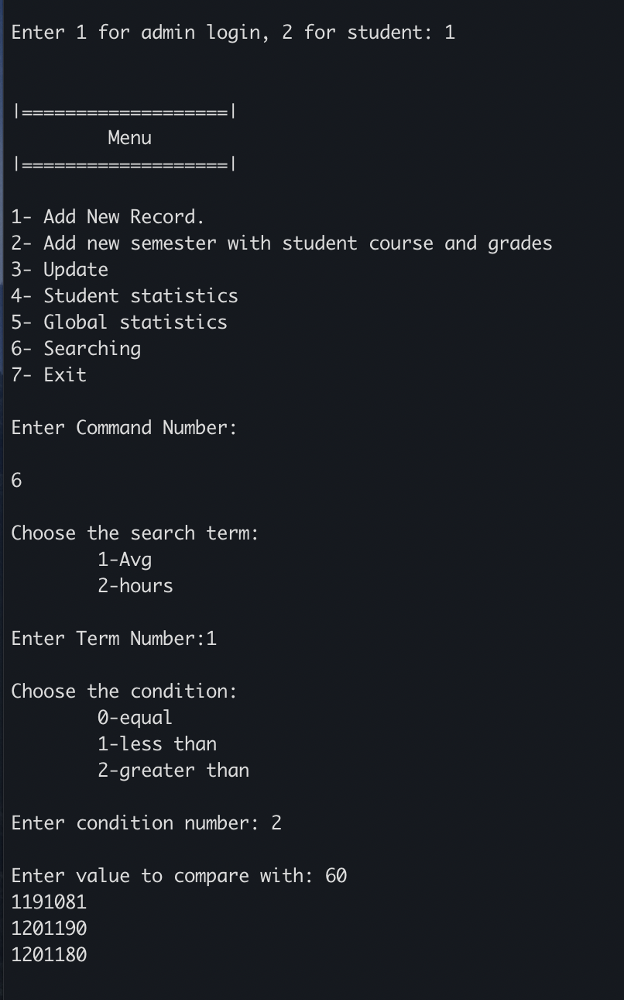
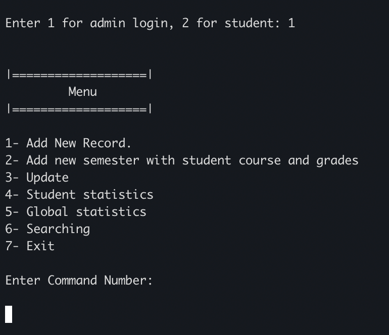
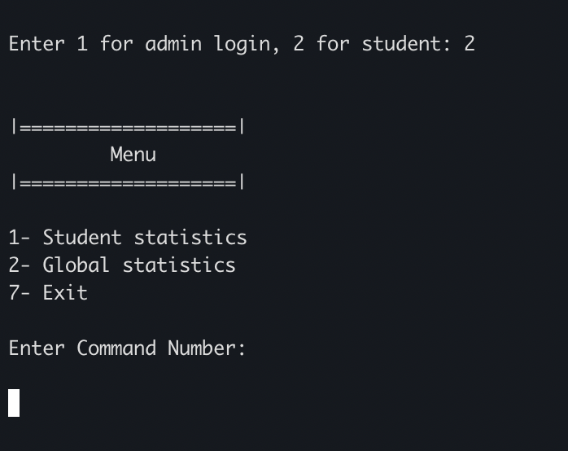
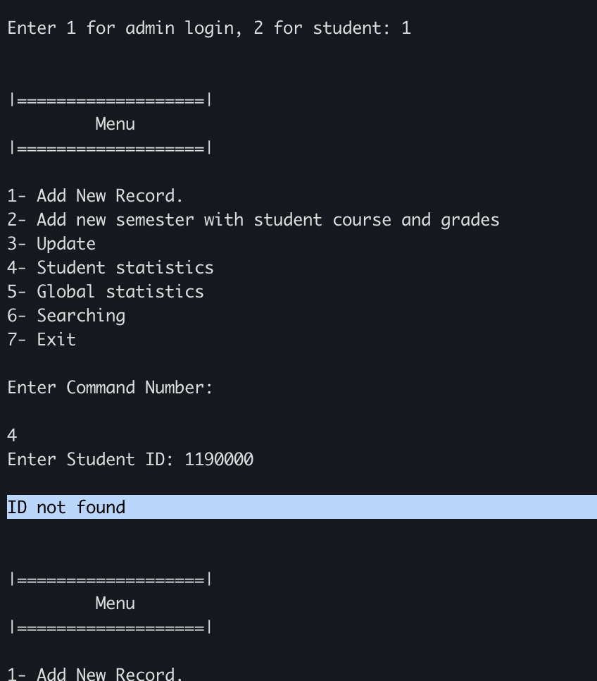
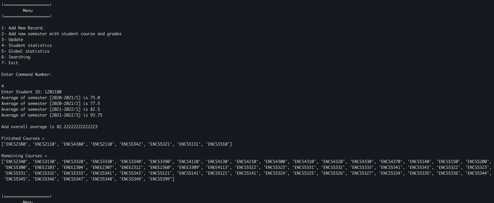
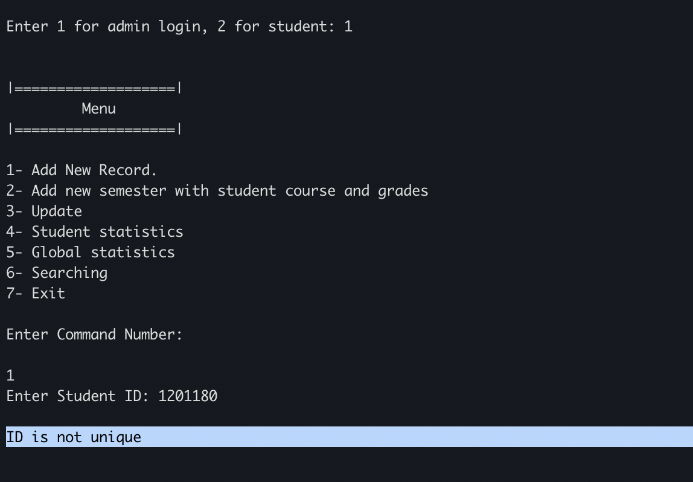
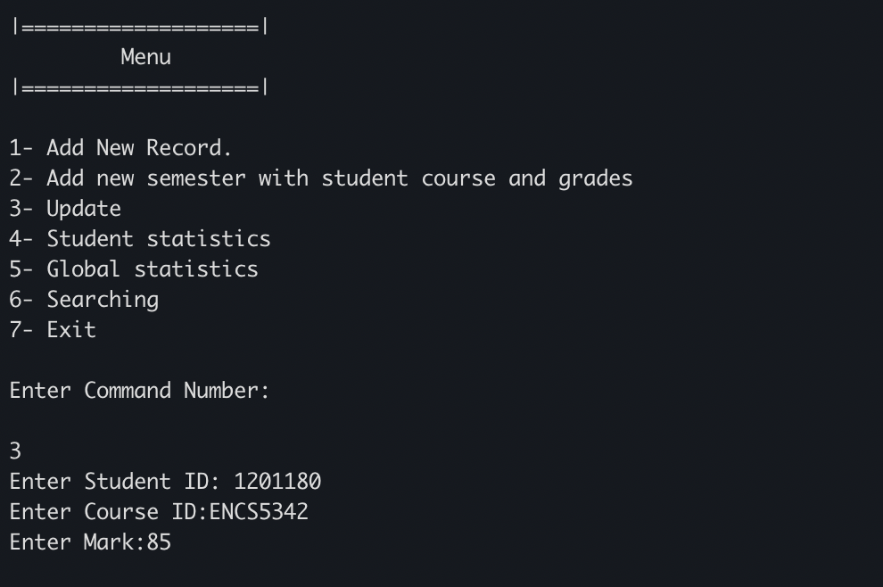
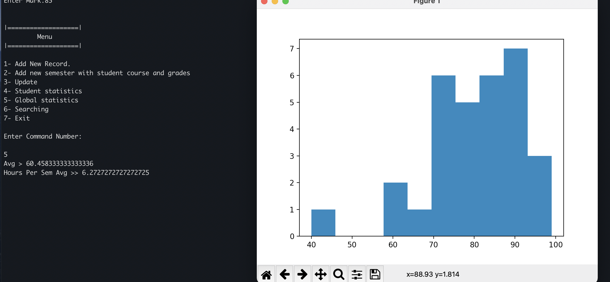
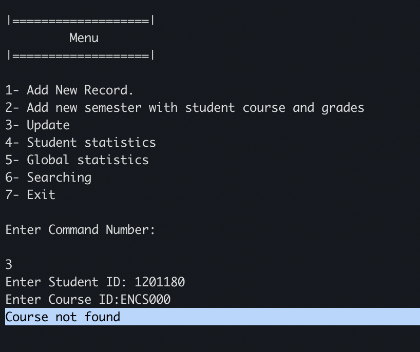

(If you'd like to view the rendered Markdown Report checkout the [Github Repository](https://github.com/hammamProg/Linux-Python-project) )

# Python Linux Lab Project
a linux lab project at [Birzeit university](https://www.birzeit.edu/en/content/encs3130-linux-laboratory)

## Contributors

* > Hammam Khaled     1191081
* > Ibraheem Alyan    1201180

---------------------------

## Project Structure

* The main script is [app.py](app.py)
* OOP stuff are in [models.py](models.py)
* command functionalities are in [utils.py](utils.py)
* students record files are gathered in the directory [db](db)

---------------------------


# Sample Data

> 1201180.txt
```
2020-2021/1 ; ENCS2380 80,ENCS2110 60
2020-2021/2 ; ENCS4380 80,ENCS2110 70
2021-2022/1 ; ENCS5342 90,ENCS5321 75
2021-2022/3 ; ENCS5131 90,ENCS3310 95
```
> 1191081.txt
```
2020-2021/1 ; ENCS2380 75,ENCS2110 40
2020-2021/2 ; ENCS4380 85,ENCS2110 99
2021-2022/2 ; ENCS5342 65,ENCS5321 60
2022-2023/3 ; ENCS5131 85,ENCS3310 99
```

# Sample Run


--------------------------

--------------------------

--------------------------

--------------------------

--------------------------

--------------------------

--------------------------

--------------------------

--------------------------